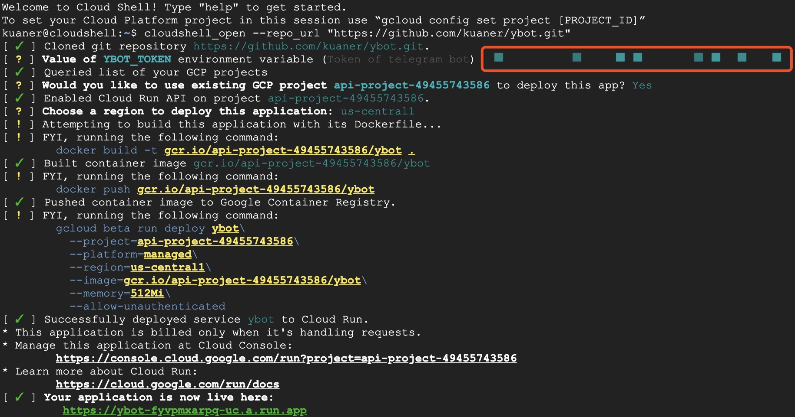

# ybot

Yet another telegram youtube bot [在 Telegram 上使用](https://t.me/autops_bot)


简单来说，就是一个把 Youtube 视频提取音频并发送到 Telegram 的小功能。只需要一步，就可以在 Telegram 播放，很适合开车听 Youtube。

[](https://console.cloud.google.com/cloudshell/editor?shellonly=true&cloudshell_image=gcr.io/cloudrun/button&cloudshell_git_repo=https://github.com/kuaner/ybot.git)



按照提示，填入 Token 后，会自动部署好，最后访问下 GCP 提供的 URL 地址，来触发部署的热部署。使用 GCP 部署后，每次要使用前，需要先通过 URL 触发下。

### 缘由

经常会在 Youtebe 上看一些语言类节目，在安卓阵营的时候，使用 Ymusic 也能基本满足需求。换到 iOS 后，问题就比较严峻了，不能后台播放，播放不停刷广告，尤其是不能 Carplay，最终促成了这个小机器人。

### 使用

功能实现上没什么复杂点，在使用上进行了点优化。利用了 Telegram 便利的 API，使用上，只需要把想听的节目在 youtube 上分享给这个机器人就行。


### 特性

- [x] 音频分段发送
- [x] ACME Support
- [x] 音频封面
- [x] 支持不依赖 FFMPEG 运行
- [ ] 同时处理同一个 Youtube 请求

### 参数

- ybot-token 在 telgram 上生成的机器人 Token

- ybot-thread 支持并行处理的任务数，依资源情况来定

- ybot-hook 机器人的运行模式 Webhook 或者 轮询

  - 在 Webhook 模式下，如果 80，443 空余支持自动获取证书配置

    - ybot-acme true

    - ybot-mail 邮箱

    - ybot-domain 预先解析域名

  - 如果需要反向代理配置

    - ybot-acme false

    - ybot-domain 预先解析域名,bot.example.com

    - ybot-port 默认 8008，

    - 使用 hostname 或者 PATH /ybot 来转发请求

- 在轮询模式下，只需要配置 Token

### 运行

依赖 FFMPEG，https://johnvansickle.com/ffmpeg/

可以使用 GCP 每月的免费额度来部署

所有参数都支持环境变量，方便在 k8s 环境下一键部署

同时提供 Docker Image [kuaner/ybot](https://hub.docker.com/r/kuaner/ybot)

- 默认以轮询模式启动，降低使用门槛

  - ```
    ./ybot -ybot-token {TOKEN HERE} > ybot.log 2>&1 &
    ```

  - ```
    docker run -d --restart=always --name ybot \
      -e YBOT_TOKEN=\${TOKEN HERE} \
      kuaner/ybot
    ```

- 推荐使用 Webhook 模式启动，运行更稳定，开启自动 TLS

  - ```
    ./ybot -ybot-token {TOKEN HERE} -ybot-hook true -ybot-acme true -ybot-domain bot.example.com -ybot-mail bot@example.com > ybot.log 2>&1 &

    ```

  - ```
    docker run -d -p 80 -p 443 --restart=always --name ybot \
     -e YBOT_TOKEN=\${TOKEN HERE} \
     -e YBOT_HOOK=TRUE \
     -e YBOT_ACME=TRUE \
     -e YBOT_DOMAIN=bot.example.com \
     -e YBOT_MAIL=bot@example.com \
     kuaner/ybot
    ```

* Webhook 模式启动，反向代理模式

  - ```
    ./ybot -ybot-token {TOKEN HERE} -ybot-hook true -ybot-acme false -ybot-domain bot.example.com -ybot-port 8008 > ybot.log 2>&1 &
    ```

  - ```
    docker run -d --restart=always --name ybot \
        -e YBOT_TOKEN=\${TOKEN HERE} \
        -e YBOT_HOOK=TRUE \
        -e YBOT_ACME=FALSE \
        -e YBOT_DOMAIN=bot.example.com \
        -e YBOT_PORT=8008 \
        kuaner/ybot
    ```

### 感谢

1. https://github.com/iawia002/annie 特别好用的 golang youtube 解析库
