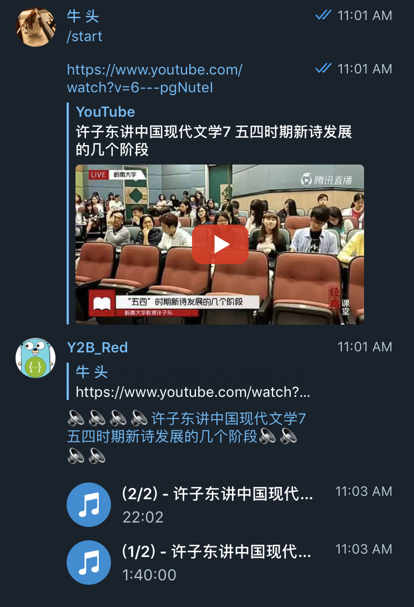

# ybot

Yet another telegram youtbe bot

简单来说，就是一个把 Youtube 视频提取音频并发送到 Telegram 的小功能。只需要一步，就可以在 Telegram 播放，很适合开车听 Youtube。

### 缘由

经常会在 Youtebe 上看一些语言类节目，在安卓阵营的时候，使用 Ymusic 也能基本满足需求。换到 iOS 后，问题就比较严峻了，不能后台播放，播放不停刷广告，尤其是不能 Carplay，最终促成了这个小机器人。

### 使用

功能实现上没什么复杂点，在使用上进行了点优化。利用了 Telegram 便利的 API，使用上，只需要把想听的节目在 youtube 上分享给这个机器人就行。



### 特性

- [x] 音频分段发送
- [x] ACME Support
- [ ] 支持无依赖 FFMPEG 运行
- [ ] 音频封面
- [ ] 同时处理通一个 Youtube 请求

### 部署

依赖 FFMPEG，https://johnvansickle.com/ffmpeg/

可以使用 GCP 每月的免费额度来部署

ybot-token 在 telgram 上生成的机器人 Token

ybot-thread 支持并行处理的任务数，依资源情况来定

ybot-hook 机器人的运行模式 webhook 或者 轮训

在 webhook 模式下，如果 80，443 空余支持自动获取证书配置

    ybot-acme true

    ybot-mail 邮箱

    ybot-domain 预先解析域名

如果需要反向代理配置

    ybot-acme false
    ybot-domain 预先解析域名,bot.example.com
    ybot-port 默认8008，
    使用hostname或者PATH /ybot 来转发请求

所有参数都支持环境变量，方便在 k8s 环境下一键部署

同时提供 Docker Image

kuaner/ybot https://hub.docker.com/r/kuaner/ybot

```Shell
docker run -d -p 80 -p 443 --restart=always --name ybot \
    -e YBOT_TOKEN=${TOKEN HERE} \
    -e YBOT_DOMAIN=bot.example.com \
    -e YBOT_MAIL=bot@example.com \
    kuaner/ybot
```
